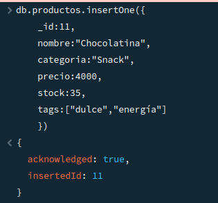
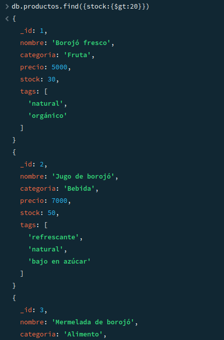
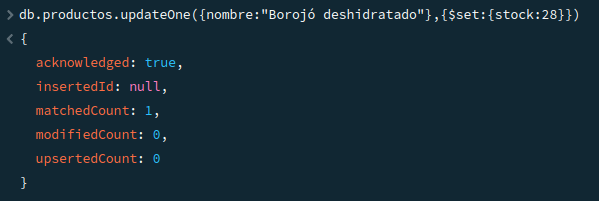
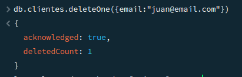
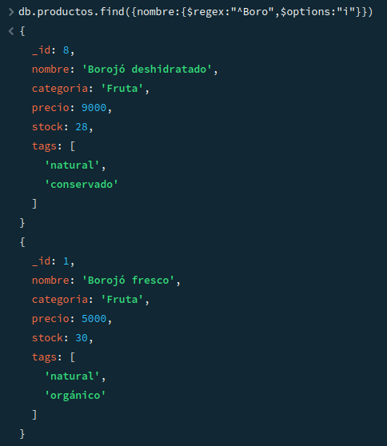
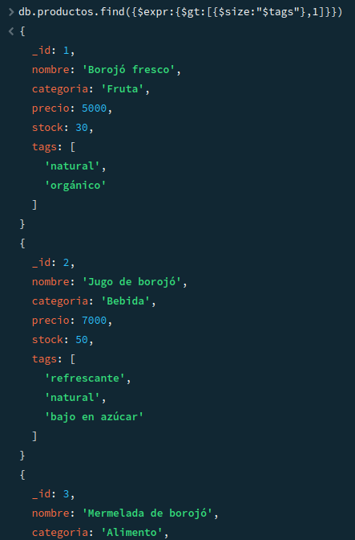
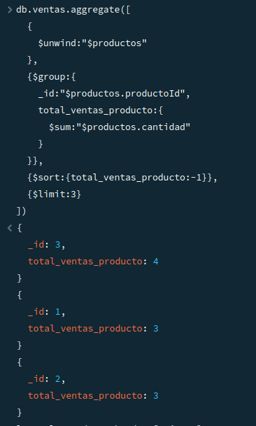
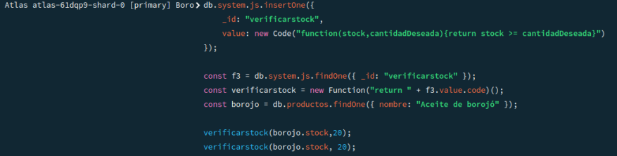
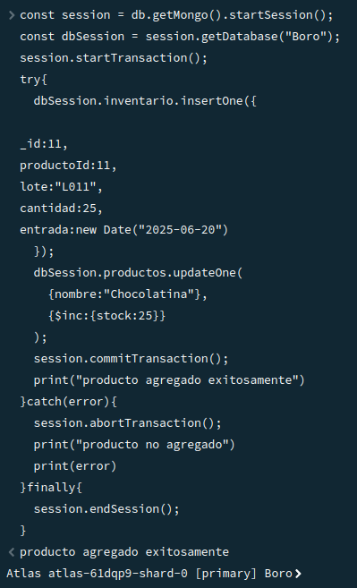
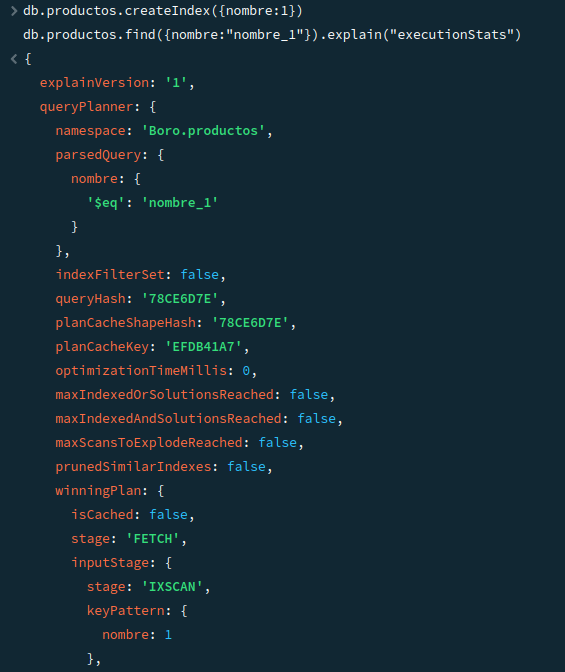

# 📘 Proyecto: [BORO]

## 1. 📖 Descripción del proyecto y del escenario
Este proyecto tiene como objetivo **[aplicar consultas tanto de lectura como con operadores regulares y arrays, actualizaciones, eliminacion, funciones, agregacion, transacciones e indexaciones]**.  
Para una tienda de productos de cualquier tipo a base de Borojó, donde se busca **[mejorar la manipulacion de los datos de la empresa.]**.  

El proyecto incluye un conjunto de ejercicios prácticos organizados por temas, que permiten aplicar los conceptos vistos en clase.

--- 

## 2. 🛠️ Instrucciones para ejecutar los scripts o cargar el dataset
Para reproducir los resultados del proyecto, sigue los siguientes pasos:

1. **Clonar el repositorio**  
   ```bash
   git clone https://github.com/ValentinaDelgadoRincon/BORO.git
   cd BORO
   ```

2. **Cargar el dataset**  
   - El dataset se encuentra en diferentes archivos js`.  
   - Si usas **MongoDB**, importa los archivos JSON con:  
     ```bash
     mongoimport --db nombreBD --collection nombreColeccion --file archivo.json --jsonArray
     ```

3. **Ejecutar los scripts**  
   Los scripts de consulta están en cada archivo .js.  
   Ejemplo para correr una consulta:  
   ```bash
   mongo nombreBD archivo/consulta1.js
   ```

---

## 3. 📑 Listado de los ejercicios desarrollados
A continuación se detallan los ejercicios trabajados, organizados según el tema:

- **Tema 1: Inserción**
  - Ejercicio 1: [Insertar un nuevo producto llamado "Chocolatina de borojó", categoría "Snack", con precio 4000, stock 35, y tags ["dulce", "energía"].]
  - Ejercicio 2: [Insertar un nuevo cliente que se llama "Mario Mendoza", con correo "mario@email.com", sin compras, y preferencias "energético" y "natural".]

- **Tema 2: Lectura**
  - Ejercicio 3: [Consultar todos los productos que tengan stock mayor a 20 unidades.]
  - Ejercicio 4: [Encontrar los clientes que no han comprado aún ningún producto.]

- **Tema 3: Actualizacion**
  - Ejercicio 5: [Aumentar en 10 unidades el stock del producto "Borojó deshidratado".]
  - Ejercicio 6: [Añadir el tag "bajo azúcar" a todos los productos de la categoría "Bebida".]

- **Tema 4: Eliminación**
  - Ejercicio 7: [Eliminar el cliente que tenga el correo "juan@email.com".]
  - Ejercicio 8: [Eliminar todos los productos con stock menor a 5 (considera esto como un proceso de limpieza de inventario).]

- **Tema 5: Operadores Regulares**
  - Ejercicio 9: [Buscar productos cuyo nombre empiece por "Boro".]
  - Ejercicio 10: [Encontrar productos cuyo nombre contenga la palabra "con" (como en “Concentrado de borojó”).]
  - Ejercicio 11: [Encontrar clientes cuyo nombre tenga la letra "z" (insensible a mayúsculas/minúsculas).]


- **Tema 6: Arrays**
  - Ejercicio 12: [Buscar clientes que tengan "natural" en sus preferencias.]
  - Ejercicio 13: [Encontrar productos que tengan al menos los tags "natural" y "orgánico" (usa $all).]
   - Ejercicio 14: [Listar productos que tienen más de un tag ($size).]

 
- **Tema 7: Aggregation framework**
  - Ejercicio 15: [Mostrar un listado de los productos más vendidos (suma total de unidades vendidas por producto).]
  - Ejercicio 16: [Agrupar clientes por cantidad de compras realizadas.]
  - Ejercicio 17: [Mostrar el total de ventas por mes (usa $group y $month).]
  - Ejercicio 18: [Calcular el promedio de precios por categoría de producto.]
  - Ejercicio 19: [Mostrar los 3 productos con mayor stock (orden descendente con $sort y $limit).]

- **Tema 8: Funciones en system.js**
  - Ejercicio 20: [Definir una función calcularDescuento(precio, porcentaje) que devuelva el precio con descuento aplicado.]
  - Ejercicio 21: [Definir una función clienteActivo(idCliente) que devuelva true si el cliente tiene más de 3 compras registradas.]
  - Ejercicio 22: [Definir una función verificarStock(productoId, cantidadDeseada) que retorne si hay suficiente stock.]

- **Tema 9: Transacciones**
  - Ejercicio 23: [Simular una venta:
    
    a. Descontar del stock del producto
    
    b. Insertar la venta en la colección `ventas`
    
    Todo dentro de una transacción.]
  - Ejercicio 24: [Simular la entrada de nuevo inventario:
    
    a. Insertar un documento en `inventario`
    
    b. Aumentar el stock del producto correspondiente
    
    Todo dentro de una transacción.]

    - Ejercicio 25: [Hacer una operación de devolución:
    
    a. Aumentar el stock
    
    b. Eliminar la venta correspondiente]

- **Tema 10: Indexación**
  - Ejercicio 26: [Crear un índice en el campo nombre de productos para mejorar búsquedas por nombre.]
  - Ejercicio 27: [Crear un índice compuesto sobre categoria y precio para facilitar búsquedas filtradas por ambas condiciones.]
  - Ejercicio 28: [Crear un índice en el campo email de clientes para validaciones rápidas de duplicados.]
  - Ejercicio 29: [Usar explain() en una consulta para mostrar si el índice de nombre está siendo utilizado.]

---

## 4. 📘 Breve explicación de cada tema
- **Tema 1** → Se realizó la inserción de un nuevo producto a la colección productos y de un nuevo cliente a la colección clientes.

- **Tema 2** → Se realizó una consulta con productos con mayor a 20 en su stock y encontrar los clientes que aún no han comprado productos.

- **Tema 3** → Se aumentaron 10 unidades al stock de un producto y se añadió un tag a otro producto.

- **Tema 4** → Se eliminó un cliente y los productos con stock menos de 5. 

- **Tema 5** → Se buscó el producto con relación a "Boro", se encontraron productos con relación a "con", y clientes que contengan la "z" en su nombre.

- **Tema 6** → Se buscaron clientes con preferencias en "natural", encontrar productos con tags natural y orgánico, y listar productos con más de un tag.

- **Tema 7** → Se mostró un listado de productos más vendidos, se agruparon los clientes por compras, mostrar el total de ventas por un mes, se calculó el promedio de precios por producto y mostrar los 3 productos con mayor stock.

- **Tema 8** → Se definió una función para calcular el descuento, otra para verificar si un cliente está activo, y otra para verificar el stock de los productos.

- **Tema 9** → Se simuló una venta en la que de descontó el stock de un producto y se insertó a la colección, se simuló la entrada de un inventario en el que seinsertó un documento y se aumentó el stock de un producto, y se realizó una operación de devolución en la que se aumentó el stock y se eliminó la venta.

- **Tema 10** → Se creó un índice para mejorar busquedas por nombre, otro para validaciones rapidas de duplicados, un índice compuesto para facilitar busquedas filtrando categorias y precios, y una consulta explain para mostrar si el índice esta siendo utilizado.

---

## 5. 📸 Evidencias (Capturas de pantalla)
A continuación se muestran las evidencias de las consultas ejecutadas y sus resultados:

- **Inserción**  
  

- **Lectura**  
  

- **Actualización**  
  

- **Eliminación**  
  

- **Expresiones Regulares**  
  

- **Arrays**  
  

- **Aggregation framework**  
  

- **Funciones system.js**  
  

- **Transacciones**  
  

- **Indexación**  
  
---

## 📌 Autores
- Nombre: [Valentina y Camila]  

---
## 📩 Contacto GitHub
- https://github.com/ValentinaDelgadoRincon
- https://github.com/CamilaFlorez12
